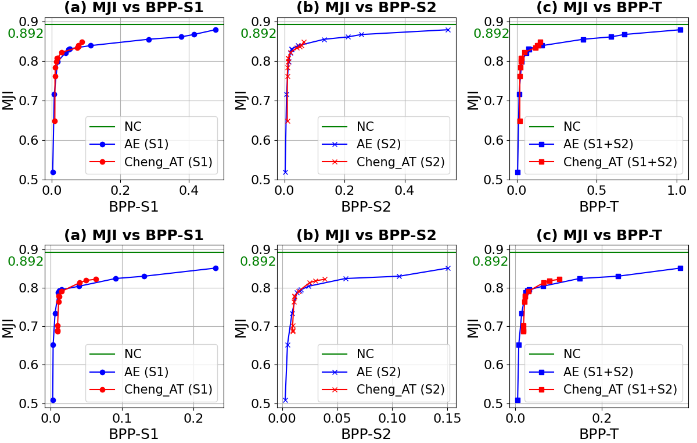
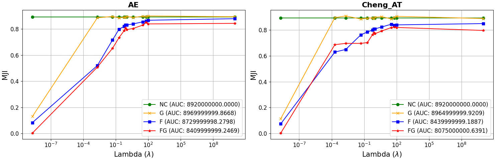
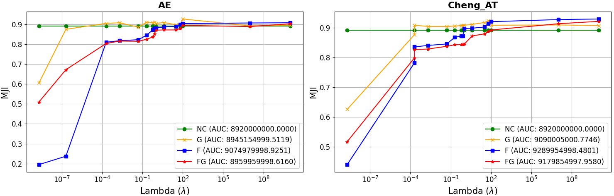
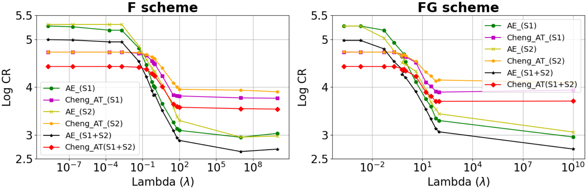
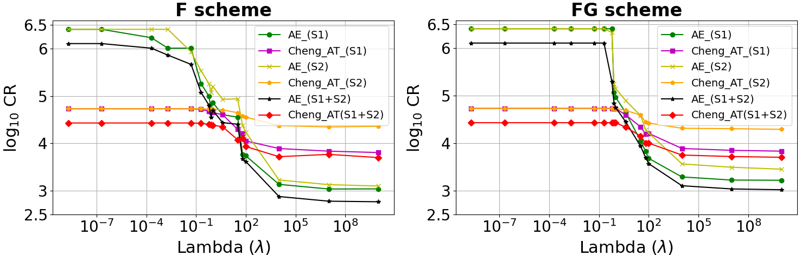
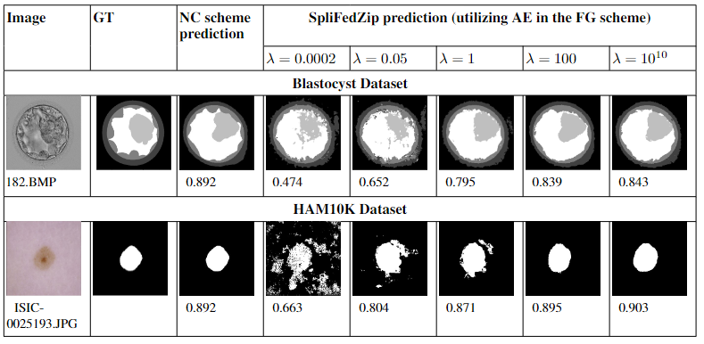

# SplitFedZip

Split-Federated(splitFed) learning [[1](#reference-1)] is an innovative approach that combines the strengths of federated learning (FL) [[2](#reference-2)] and split learning (SL) [[3](#reference-3)].
This repository is the Python implementation of the paper "_SplitFedZip: Learned Compression for Data Transfer Reduction in Split-Federated Learning_". 

Table of Contents

1. [Overview](#overview)
2. [Features](#features)
3. [Installation](#installation)
4. [Usage](#usage)
5. [Datasets](#datasets)
6. [Contact](#contact)
7. [Citation](#citation)
8. [References](#references)

# Overview
SplitFedZip is the first rate-distortion based compression scheme designed for splitFed networks. It aims to improve the communication efficiency in SplitFed Learning. This approach addresses key communication challenges such as high latency, bandwidth constraints, and synchronization overheads in SplitFed learning while maintaining or enhancing global model performance.

The first application of optmizing the communication accuracy trade-off in FL using rate distortion theory was introduced in [[4](#reference-4)]. Since then, there has been a notable lack of evidence in the application of rate-distortion-inspired compression in SL and splitFed.

SplitFedZip was tested on two medical image segmentation datasets (Blastocyst dataset and the HAM10K dataset), which achieved significant communication bitrate reduction with minimal impact on global model accuracy. 
SplitFedZip is designed with 4 compression schemes as _NC scheme_ (No Compression), _F scheme_ (Compressing only features), _G scheme_ (Compressing only gradients) and _FG scheme_ (Compressing both features and gradients). The relevant codes for these 4 schemes are included in the _baseline_splitFed_NC_, _F scheme_, _G scheme_ and the _FG scheme_, respectively. We used two types of codecs: A Custom AE [[5](#reference-5)], and a Cheng_2020 model [[6](#reference-6)]. 

Figure 1 and Figure 2 shows the R-D curves for the F and FG schemes with the Blastocyst dataset and the HAM10K dataset. 


**Figure 1:** R-D curves for (i) F and (ii) FG schemes with the Blastocyst dataset. Top row is for the F scheme, bottom row is for the FG scheme.


**Figure 2:** R-D curves for (i) F and (ii) FG schemes with the HAM10K dataset. Top row is for the F scheme, bottom row is for the FG scheme.

# Features
Following are some of the unique features of SplitFedZip.

1. Learned Compression: SplitFedZip uses advanced codecs to compress feature maps and gradients at the split points.
2. Efficient Communication: It decreases communication overhead, hence addressing bandwidth and latency challenges common in federated contexts.
3. Flexible Architecture: Combines the benefits of Federated Learning (FL) and Split Learning (SL), balancing computational loads between the client and server.
4. Privacy Preservation: There is no need to share local data between clients and the server, therefore privacy is secured. Existence of two split points further gurantee the privacy. 

Following is a MJI variation analysis for the compression schemes:

We studied the MJI variation for the four compression schemes by calculating the area under the curve (AUC) of the MJI curves. Fig. 3 is for the Blastocyst dataset and Fig. 4 is for the HAM10K dataset. We show the MJI variation separately for the AE (left graph in each figure) and the Cheng\_AT (right graph in each figure). AUC was calculated using the trapezoidal rule with the numpy.trapz package. 


**Figure 3:** MJI vs. λ for the four compression schemes: Blastocyst dataset.


**Figure 4:** MJI vs. λ for the four compression schemes: HAM10K dataset.

We mark the calculated AUC of each curve in the legends. Since both the x-axis (λ) and the y-axis (MJI) are dimensionless, the AUC is also dimensionless and represents a numerical value of the area. AUC values for the Blastocyst dataset behave as $\text{G}_{\text{AUC}} > \text{NC}_{\text{AUC}} > \text{F}_{\text{AUC}} > \text{FG}_{\text{AUC}}$. AUC values for the HAM10K dataset behave as $\text{F}_{\text{AUC}} > \text{FG}_{\text{AUC}} > \text{G}_{\text{AUC}} > \text{NC}_{\text{AUC}}$. This AUC analysis aligns with the R-A curves: SplitFedZip's F, FG and G schemes outperform the NC scheme for the HAM10K dataset, while showing slightly lower performance for the Blastocyst dataset.


Following is a Compression Ratio(CR) analysis for the compression schemes:

Fig.5 shows the CR variation with λ for the Blastocyst dataset. Fig.6 shows the same for the HAM10K dataset. We show the MJI variation separately for the F scheme (left graph in each figure) and the FG scheme (right graph in each figure). At lower λ, AE had a higher CR, while Cheng\_AT had a lower CR. In contrast, at higher $\lambda$, Cheng\_AT showed a higher CR, and AE showed a lower CR. The reasons for these behaviors could be due to the trade-offs between compression efficiency and the reconstruction quality (or the information fidelity) of the two codecs.  AEs perform well with lower $\lambda$ due to their design focus on aggressive compression. In contrast, Cheng\_AT performs better at higher $\lambda$ because it balances quality preservation and compression more effectively.


**Figure 5:** CR vs. λ: Blastocyst dataset.


**Figure 6:** CR vs. λ: HAM10K dataset.

Following is a qualitative comparison with two samples of the two datasets.

**Figure 7:** Qualitative comparison of two samples with different λ.

# Installation
Clone the repository:
```
git clone https://anonymous.4open.science/r/SplitFedZip.git
```

Navigate to SplitFedZip folder:
```
cd SplitFedZip
```

Install required packages:
```
pip install -r requirements.txt
```

# Usage

To train the model on medical image segmentation data:
- Go to the folder where you want to perform the compression. The .py files are renamed as the codec name with the dataset name.  
- Add the location to data at: dataDir = LOCATION_TO_DATA.
- Add the location for saving checkpoints, validated images, tested images, and output curves at: compressedF = LOCATION_TO_COMPRESSED_DATA_FOLDER.
- Add the location to the output log at: output_file = LOCATION_TO_OUTPUT_FILE.
- Change the value of the lagrangian multiplier at: lambda1 = _value_.

Use the _runner.sh_ to start training. 

To generate the Figures in the paper, please go to the _Plotting_ folder.

# Datasets
Following are the two datasets used in the experiments.
1. Blastocyst Dataset [[7](#reference-7)].
2. HAM10K Dataset [[8](#reference-8)].

# Contact
Please contact the corresponding authors of the paper for any inquiries regarding this project.

# Citation
If you find this project useful in your research, please cite our paper:

```bibtex
@article{Anonymous_2024,
  title={SplitFedZip: Learned Compression for Data Transfer Reduction in Split-Federated Learning},
  author={Anonymous},
  journal={Proceeding of XXX},
  year={2024}
}
```

## References

<a id="reference-1"></a>
1. Thapa, Chandra, Pathum Chamikara Mahawaga Arachchige, Seyit Camtepe, and Lichao Sun. "Splitfed: When federated learning meets split learning." In Proceedings of the AAAI Conference on Artificial Intelligence, vol. 36, no. 8, pp. 8485-8493. 2022.
<a id="reference-2"></a>
2. McMahan, Brendan, Eider Moore, Daniel Ramage, Seth Hampson, and Blaise Aguera y Arcas. "Communication-efficient learning of deep networks from decentralized data." In Artificial intelligence and statistics, pp. 1273-1282. PMLR, 2017.
<a id="reference-3"></a>
3. Gupta, Otkrist, and Ramesh Raskar. "Distributed learning of deep neural network over multiple agents." Journal of Network and Computer Applications 116 (2018): 1-8.
<a id="reference-4"></a>
4. Mitchell, Nicole, Johannes Ballé, Zachary Charles, and Jakub Konečný. "Optimizing the communication-accuracy trade-off in federated learning with rate-distortion theory." arXiv preprint arXiv:2201.02664 (2022).
<a id="reference-5"></a>
5. Ballé, Johannes, David Minnen, Saurabh Singh, Sung Jin Hwang, and Nick Johnston. "Variational image compression with a scale hyperprior." In International Conference on Learning Representations. 2018.
<a id="reference-6"></a>
6. Cheng, Zhengxue, Heming Sun, Masaru Takeuchi, and Jiro Katto. "Learned image compression with discretized gaussian mixture likelihoods and attention modules." In Proceedings of the IEEE/CVF conference on computer vision and pattern recognition, pp. 7939-7948. 2020.
<a id="reference-7"></a>
7. Lockhart, Lisette, Parvaneh Saeedi, Jason Au, and Jon Havelock. "Multi-label classification for automatic human blastocyst grading with severely imbalanced data." In 2019 IEEE 21st International Workshop on Multimedia Signal Processing (MMSP), pp. 1-6. IEEE, 2019.
<a id="reference-8"></a>
8. Tschandl, Philipp, Cliff Rosendahl, and Harald Kittler. "The HAM10000 dataset, a large collection of multi-source dermatoscopic images of common pigmented skin lesions." Scientific data 5, no. 1 (2018): 1-9.
